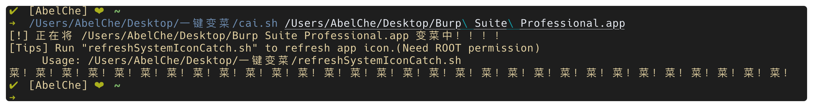
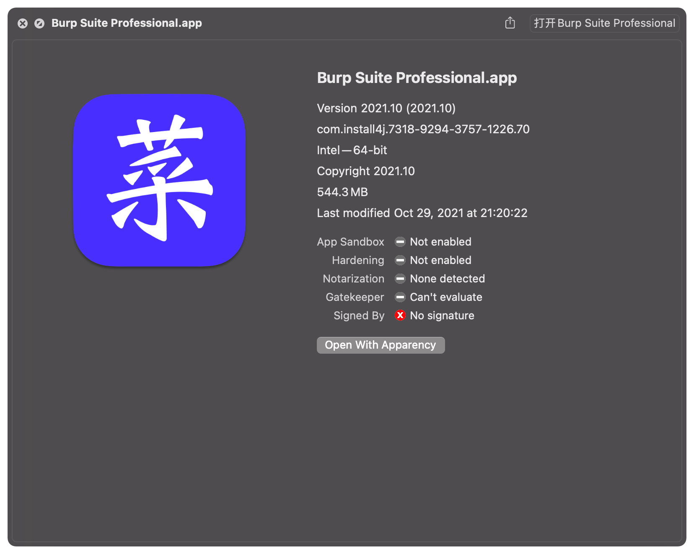
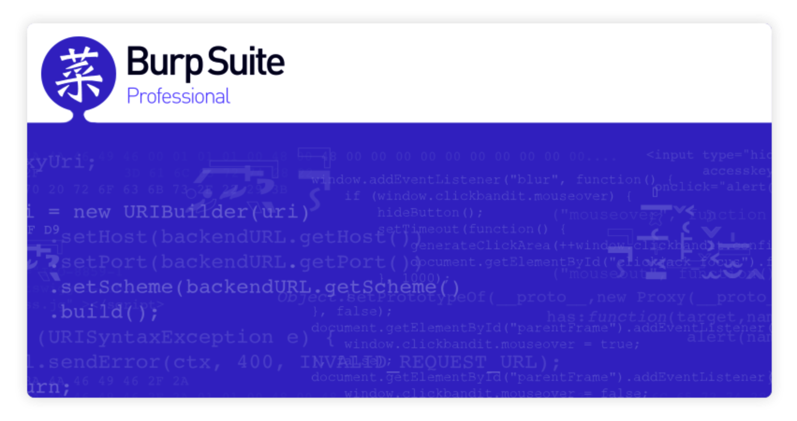
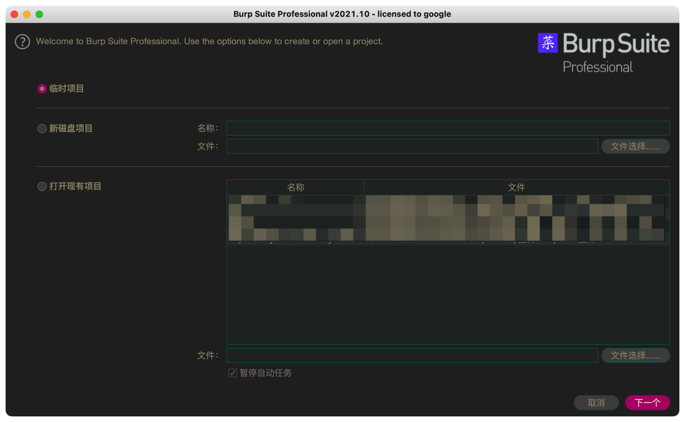

<p style="text-align: center;">

</p>

# 一键变菜

让你的burpsuite一键变菜！

## 使用方法

```shell
chmod +x cai.sh
./cai.sh /Path/Of/Burp\ Suite\ Professional.app   #指定burp应用路径
# 或者使用默认路径 /Applications/Burp Suite Professional.app
./cai.sh                                          #使用默认burp应用路径/Applications/Burp Suite Professional.app
```









